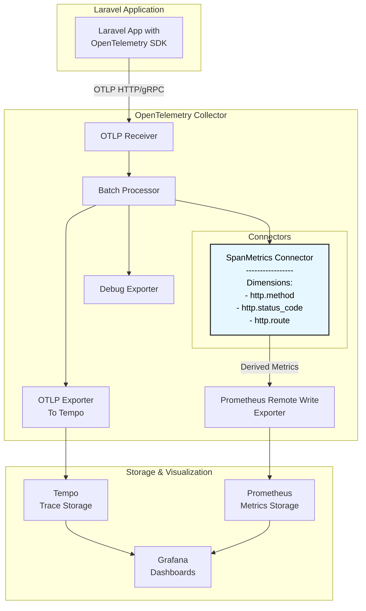

# OpenTelemetry Laravel APM (Application Performance Management)

This repository is a reference from [blueswen/opentelemetry-apm](https://github.com/blueswen/opentelemetry-apm) and provides a Laravel package for integrating OpenTelemetry into your Laravel applications. 

## Overview

OpenTelemetry is an observability framework for cloud-native software that provides APIs, libraries, agents, and instrumentation to collect telemetry data—such as traces, metrics, and logs—from your applications.

This package offers an example Laravel setup that demonstrates how to collect and monitor telemetry data.

## Features

- Automatic instrumentation of Laravel traces
- Metrics generation from Laravel traces by [opentelemetry-collector-contrib](https://github.com/open-telemetry/opentelemetry-collector-contrib)


## Quick Start

1. Copy .env.example to .env and update the following environment variables

```shell
cp .env.example .env
```

2. Start the application

```shell
docker-compose up -d
```

3. Run artisan commands

```shell
docker compose exec laravel php artisan key:generate
docker compose exec laravel php artisan migrate --seed
```

4. Generate test traffic with k6

```shell
docker run --rm -i -u root -v $(pwd)/k6.js:/home/k6/k6.js --net host  grafana/k6 run k6.js
```

5. Visit the [Grafana](http://localhost:8001) dashboard.

## Explain

### Laravel

1. Install the extension and enable it

    ```shell
    pecl install opentelemetry
    php --ri opentelemetry      // Verify that the extension is installed and enabled:
    ```

2. Add additional dependencies to your application, which are required for the automatic instrumentation of your code:

    ```shell
    composer require open-telemetry/opentelemetry-auto-laravel
    composer require open-telemetry/sdk
    composer require open-telemetry/exporter-otlp
    ```

    | Package | Description |
    | --- | --- |
    | open-telemetry/opentelemetry-auto-laravel | Automatic instrumentation of Laravel traces |
    | open-telemetry/sdk | SDK for opentelemetry |
    | open-telemetry/exporter-otlp | OTLP exporter |

    For more dependencies, see [packagist](https://packagist.org/?query=open-telemetry)

3. Configure the OpenTelemetry SDK

    Add the following environment variables to your application's environment.

    ```php
    OTEL_PHP_AUTOLOAD_ENABLED=true    // enable PHP OpenTelemetry
    OTEL_SERVICE_NAME=laravel-apm     // Config service name
    OTEL_RESOURCE_ATTRIBUTES=deployment.environment=prod,service.version=0.0.1    // Config attributes
    OTEL_EXPORTER_OTLP_ENDPOINT=http://otel-collector:4318    // Config OpenTelemetry Collector endpoint
    ```

### OpenTelemetry Collector

Configure the OpenTelemetry Collector by `etc/opentelemetry-collector-config.yaml`

Opentelemetry Collector will collect traces and calculate metrics from traces using the [spanmetrics connector](https://github.com/open-telemetry/opentelemetry-collector-contrib/blob/main/connector/spanmetricsconnector/README.md).


